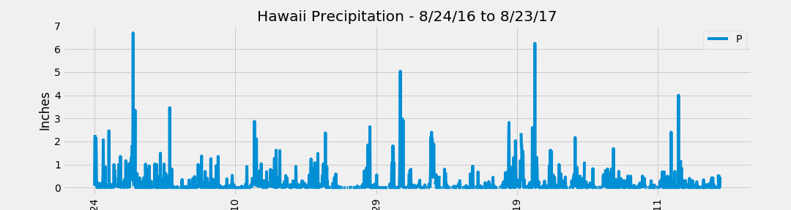
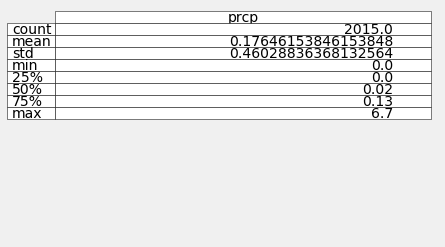
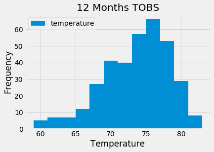

##Kristy Anderson 
##August 30, 2020 
##Data Analytics 
##SQLAlchemy-Challenge Homework 

We were tasked to use SQLAlchemy and Flask API to explore and analyze climate data from a hawaii.sqlite database. 
Analyis was performed using Python and Pandas (Jupyter Notebook). 

Step 1:
1. Climate Analysis and Expoloration
1. Preciption Analysis

3. Station Analysis

Step 2:
Climate App
